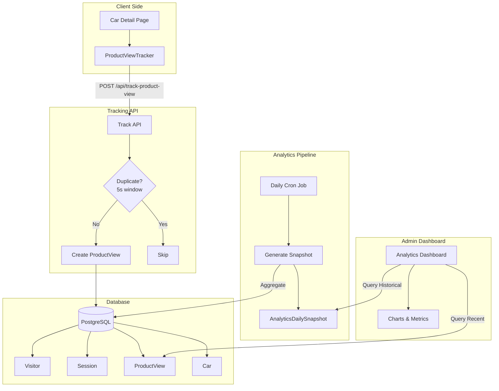

# Analytics System Architecture & Implementation

**Version:** 3.0 (Product Analytics Upgrade)
**Goal:** Enterprise-grade product analytics with engagement tracking and conversion funnel insights.

---

## Pages Tracked

### 1. **General Page Views** (All Pages)
- **Tracked via**: `/api/track-visit` (existing)
- **Model**: `PageView`
- **Data**: path, referer, device, browser, OS, country
- **Pages**:
  - Home page (`/`)
  - Cars listing (`/cars`)
  - About page (`/about`)
  - Contact page (`/contact`)
  - Services page (`/services`)
  - Luxury page (`/luxury`)
  - Login page (`/login`)

### 2. **Product Views** (Car Detail Pages)
- **Tracked via**: `/api/track-product-view` (NEW)
- **Model**: `ProductView`
- **Data**: carId, durationMs, scrollDepth, source, referer
- **Pages**:
  - Individual car detail pages (`/cars/[id]`)
- **Component**: `<ProductViewTracker carId={car.id} />`
- **Engagement Metrics**:
  - Time spent on page (durationMs)
  - Scroll depth percentage (0-100)
  - Traffic source (direct/referral/internal)
  - Referrer URL

### 3. **Conversion Events** (Enquiries)
- **Tracked via**: `/api/enquiry` (existing)
- **Model**: `Enquiry`
- **Links to**: `carId` (for conversion attribution)

---

## 1. Core Architecture Evolution

### Version 2.0 → 3.0 Upgrade

**Previous (Generic Page Tracking)**:
- `PageView` → Stores path only
- No product-specific insights
- Heavy live aggregations

**New (Product Analytics)**:
- `ProductView` → Car-specific engagement tracking
- `AnalyticsDailySnapshot` → Precomputed metrics
- Conversion funnel (Views → Enquiries)

---

## 2. Architecture Diagram



---

## 3. Database Schema (Updated)

### New: `ProductView`
Tracks product-level engagement with metrics that matter for conversion analysis.

**Fields**:
- `carId`: Links to Car (which product)
- `visitorId`, `sessionId`: User context
- `durationMs`: Time spent on product page (client-tracked)
- `scrollDepth`: 0-100 percentage (engagement quality)
- `source`: organic/paid/direct/referral (attribution)
- `referer`: Original referrer URL

**Indexes**:
- `[carId, viewedAt]` → Most viewed products by date
- `[visitorId]` → User journey analysis
- `[sessionId]` → Session engagement patterns

### New: `AnalyticsDailySnapshot`
Precomputed daily metrics to avoid expensive live queries.

**Why?**: Querying `count(*)` on millions of rows is slow. Snapshots cache aggregated data.

**Fields**:
- `date`: The snapshot date (unique)
- `totalVisitors`, `totalSessions`, `totalPageViews`: Core traffic
- `totalProductViews`, `totalEnquiries`: Conversion funnel
- `avgSessionDurationMs`, `avgProductViewDurationMs`: Engagement
- `viewToEnquiryRate`: Conversion percentage

**Usage**: Dashboard queries snapshots for historical data (last 30 days), only queries live tables for today.

---

## 4. Tracking Implementation

### Client-Side: `ProductViewTracker` Component

```tsx
'use client';
import { useEffect, useRef } from 'react';

export function ProductViewTracker({ carId }: { carId: string }) {
  const startTime = useRef(Date.now());
  const maxScroll = useRef(0);

  useEffect(() => {
    // Track scroll depth
    const handleScroll = () => {
      const scrollPercentage = (window.scrollY / (document.documentElement.scrollHeight - window.innerHeight)) * 100;
      maxScroll.current = Math.max(maxScroll.current, scrollPercentage);
    };

    window.addEventListener('scroll', handleScroll);

    // Send tracking data on unmount
    return () => {
      const durationMs = Date.now() - startTime.current;
      
      // Only track if user spent > 3 seconds
      if (durationMs > 3000) {
        fetch('/api/track-product-view', {
          method: 'POST',
          headers: { 'Content-Type': 'application/json' },
          credentials: 'include',
          body: JSON.stringify({
            carId,
            durationMs,
            scrollDepth: Math.round(maxScroll.current),
            source: document.referrer ? 'referral' : 'direct',
            referer: document.referrer || null,
          }),
        }).catch(console.error);
      }
      
      window.removeEventListener('scroll', handleScroll);
    };
  }, [carId]);

  return null;
}
```

**Key Features**:
- Tracks time spent (on unmount, to capture full duration)
- Debounced scroll tracking
- Only sends if duration > 3s (filters bounces)
- Uses `credentials: 'include'` for visitor cookie

---

## 5. API Endpoint: `/api/track-product-view`

**Logic**:
1. Validate visitor cookie (reuse existing visitor system)
2. Get/create session
3. **Deduplication**: Check if same visitor viewed same car in last 5 seconds
4. Create `ProductView` record with engagement metrics
5. Return success

**Performance**: Uses same deduplication pattern as PageView.

---

## 6. Daily Snapshot Generation

### Cron Job: `/api/analytics/generate-snapshot`

Runs daily at 2 AM UTC. Aggregates yesterday's data.

**Query Example**:
```typescript
const yesterday = startOfDay(subDays(new Date(), 1));

const totalProductViews = await prisma.productView.count({
  where: { viewedAt: { gte: yesterday, lt: today } }
});

await prisma.analyticsDailySnapshot.upsert({
  where: { date: yesterday },
  update: { totalProductViews, ... },
  create: { date: yesterday, totalProductViews, ... },
});
```

**Benefit**: Dashboard queries snapshots instead of counting millions of rows.

---

## 7. Dashboard Architecture

### Performance Pattern
- **Historical data (> 24h ago)**: Query `AnalyticsDailySnapshot`
- **Recent data (last 24h)**: Query live tables (ProductView, etc.)
- **Result**: Fast queries, no heavy aggregations

### Top Viewed Cars Query
```typescript
const topCars = await prisma.productView.groupBy({
  by: ['carId'],
  _count: { carId: true },
  _avg: { durationMs: true, scrollDepth: true },
  where: { viewedAt: { gte: last30Days } },
  orderBy: { _count: { carId: 'desc' } },
  take: 10,
});

// Enrich with car details + enquiry count
```

### Conversion Funnel
```typescript
const visitors = await prisma.visitor.count();
const productViews = await prisma.productView.count();
const enquiries = await prisma.enquiry.count();

const funnel = [
  { stage: 'Visitors', count: visitors, percentage: 100 },
  { stage: 'Product Views', count: productViews, percentage: (productViews / visitors) * 100 },
  { stage: 'Enquiries', count: enquiries, percentage: (enquiries / visitors) * 100 },
];
```

---

## 8. Key Improvements Over v2.0

| Aspect | v2.0 | v3.0 |
|--------|------|------|
| **Product Insights** | ❌ None (only generic path tracking) | ✅ Per-car engagement metrics |
| **Engagement Tracking** | ❌ No time/scroll data | ✅ Duration + scroll depth |
| **Query Performance** | ❌ Heavy live aggregations | ✅ Precomputed snapshots |
| **Conversion Tracking** | ❌ Not possible | ✅ Full funnel (Views → Enquiries) |
| **Attribution** | ❌ No source tracking | ✅ Source + referrer capture |
| **Dashboard** | ✅ Basic visitor stats | ✅ Enterprise-grade analytics |

---

## 9. Next Steps for Agents

When implementing this upgrade:
1. **Schema first**: Add models, run migration
2. **Tracking second**: Build tracker component + API
3. **Snapshot third**: Create cron job
4. **Dashboard last**: Build UI with precomputed data

**Critical Files**:
- Schema: `prisma/schema.prisma`
- Tracker: `components/ProductViewTracker.tsx`
- API: `app/api/track-product-view/route.ts`
- Cron: `app/api/analytics/generate-snapshot/route.ts`
- Dashboard: `app/admin/analytics/page.tsx` (new structure)
